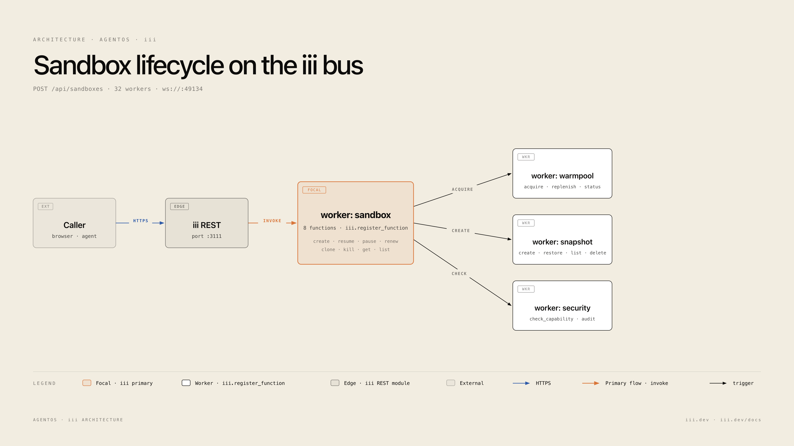
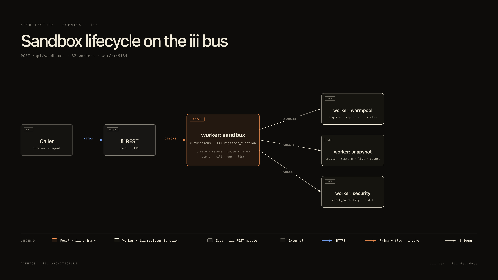
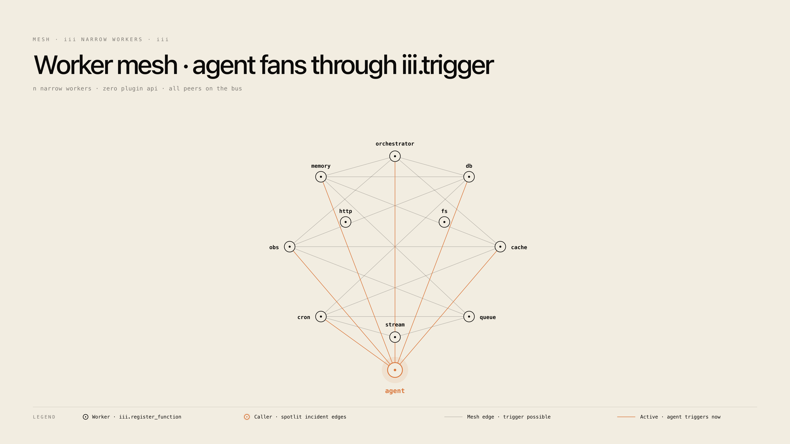
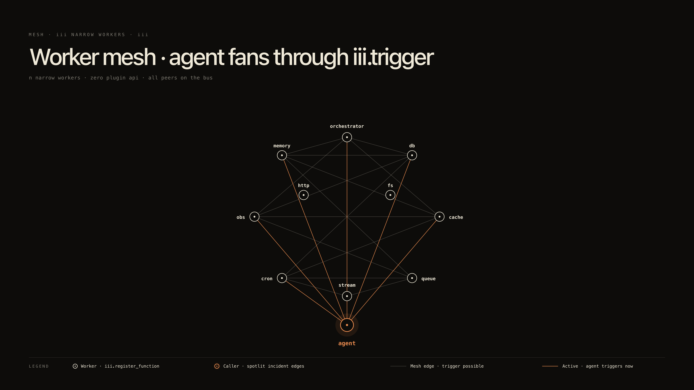
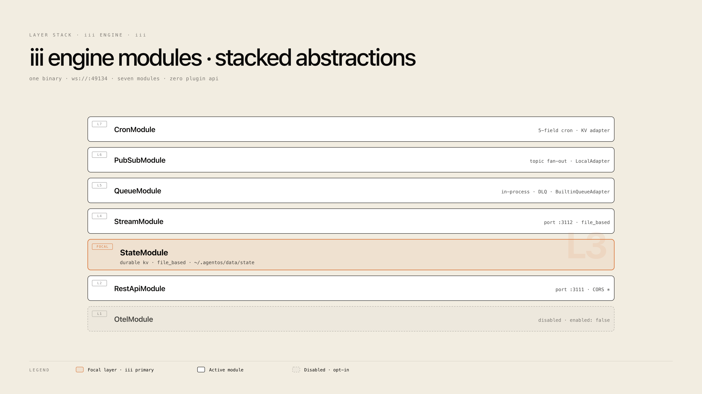
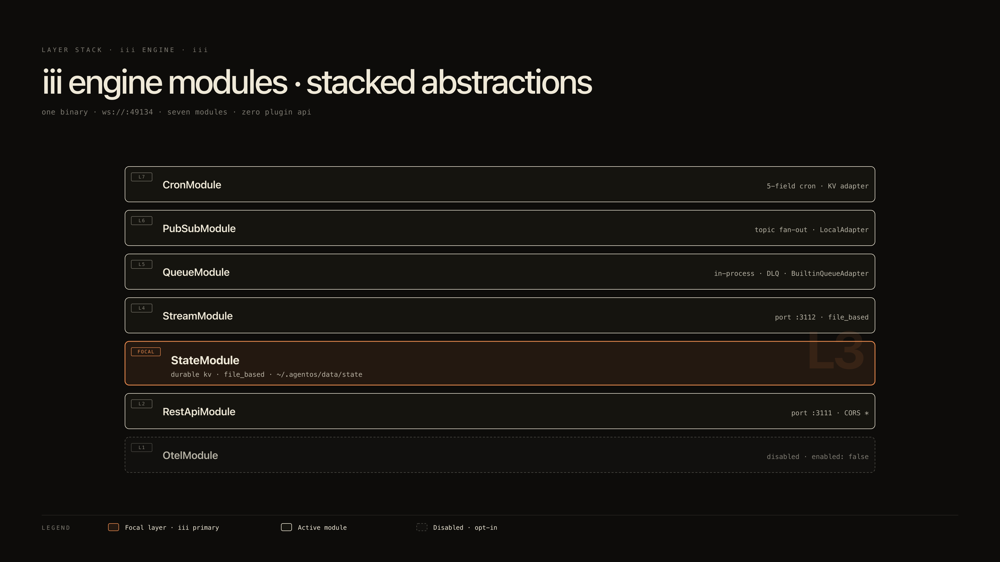
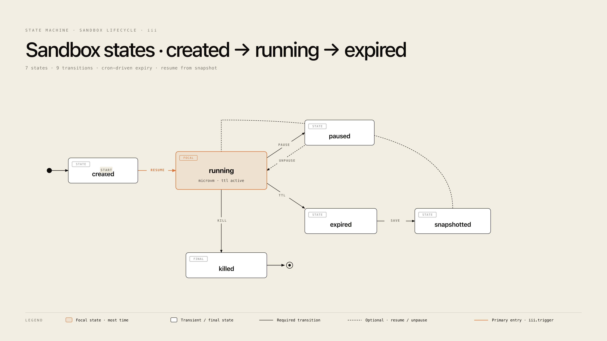
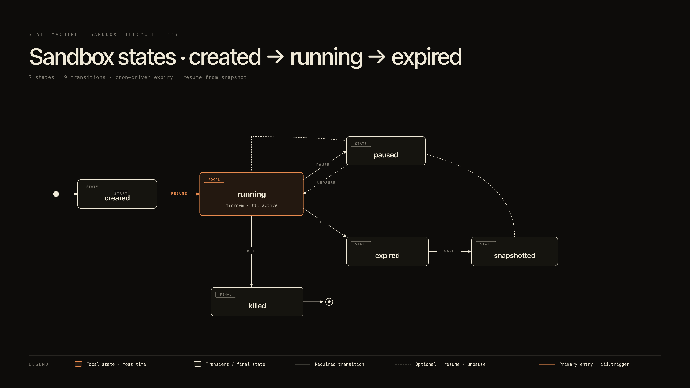
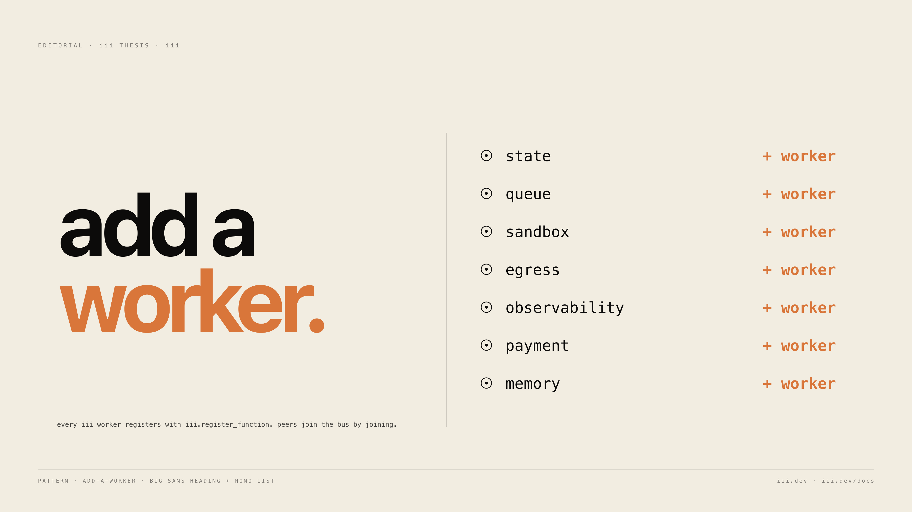
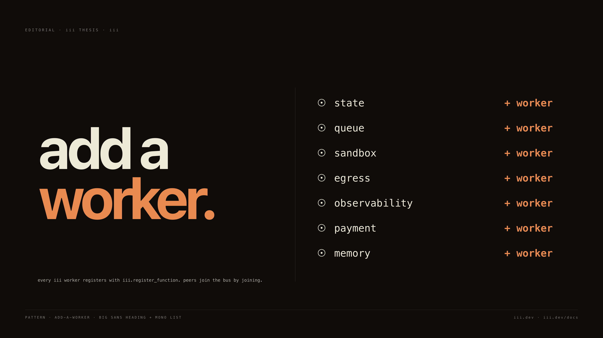

# diagram-skills

Four skills for documenting [iii](https://iii.dev) projects with a consistent visual vocabulary.

| Skill | Output | When to use |
|---|---|---|
| [`iii-architecture-diagram`](./iii-architecture-diagram/) | `.svg` (+ optional `.png`) | Single-page architecture / mesh / state-machine / layer-stack / editorial diagram |
| [`iii-infographic`](./iii-infographic/) | self-contained `.html` | Printable system reference (6–8 numbered sections); also handles diff reviews, plan reviews, project recaps |
| [`iii-slides`](./iii-slides/) | self-contained `.html` | Single-file scroll-snap slide deck (100dvh per slide) for talks and demos |
| [`iii-playground`](./iii-playground/) | self-contained `.html` | Throwaway interactive editor with `copy-as-prompt` export — kanban, tuner, form-editor, split-preview, or curate |

All four skills share the iii editorial register: cream paper canvas (or warm dark), ember accent reserved for one focal element, Inter Tight + JetBrains Mono. Full brand contract in each skill's `SKILL.md` plus its `references/`.

## Commands

| Command | Skill | What it builds |
|---|---|---|
| `/iii-diagram <topic>` | iii-architecture-diagram | A single SVG architecture / mesh / layer-stack / state-machine / editorial diagram |
| `/iii-infographic <project-path>` | iii-infographic | Full §01–§08 system reference HTML page |
| `/iii-diff-review <git-ref>` | iii-infographic | Before/after infographic with iii vocabulary (no GitHub red/green) |
| `/iii-plan-review <plan-file>` | iii-infographic | Plan-vs-codebase audit, every claim cited |
| `/iii-project-recap` | iii-infographic | HEAD-state snapshot for context-switching |
| `/iii-slides <topic-or-source-file>` | iii-slides | Scroll-snap slide deck |
| `/iii-playground <task>` | iii-playground | Throwaway HTML editor with `copy-as-prompt` button (pick one of five patterns) |

Slash commands surface in agents that support them. In Claude Code they're namespaced once installed as plugins (`/iii-architecture-diagram:iii-diagram`, etc.). For agents that don't support commands, read the matching `commands/*.md` file and follow the instructions manually — the skill itself (`SKILL.md` + `references/`) is the source of behavior.

## Patterns

Five diagram patterns ship in `iii-architecture-diagram/assets/`. Every pattern has a cream variant and a dark variant; pick to match the target medium (deck, README, terminal, slide).

<table>
<tr>
<td align="center" width="50%">
  
  <br/><b>Architecture</b><br/>
  <sub>Components + connections · one focal worker · 6 nodes · ember primary flow</sub>
</td>
<td align="center" width="50%">
  
  <br/><b>Architecture · dark</b><br/>
  <sub>Same vocabulary · warm <code>#0d0c0a</code> canvas · brighter ember + link</sub>
</td>
</tr>
<tr>
<td align="center">
  
  <br/><b>Mesh</b><br/>
  <sub>N narrow workers around a hub · agent spotlit with ember edges · subset-mesh edges</sub>
</td>
<td align="center">
  
  <br/><b>Mesh · dark</b><br/>
  <sub>The iii.dev landing aesthetic · thin strokes on warm dark</sub>
</td>
</tr>
<tr>
<td align="center">
  
  <br/><b>Layer stack</b><br/>
  <sub>Stacked abstractions · iii engine modules with adapter classes · one focal layer</sub>
</td>
<td align="center">
  
  <br/><b>Layer stack · dark</b><br/>
  <sub>Same stack · disabled module shown as dashed</sub>
</td>
</tr>
<tr>
<td align="center">
  
  <br/><b>State machine</b><br/>
  <sub>States + transitions · sandbox lifecycle · one focal state · masked arrow labels</sub>
</td>
<td align="center">
  
  <br/><b>State machine · dark</b><br/>
  <sub>Optional transitions dashed · primary entry in ember</sub>
</td>
</tr>
<tr>
<td align="center">
  
  <br/><b>Add a worker (editorial)</b><br/>
  <sub>Big sans heading + mono list · introduces the iii narrow-workers thesis</sub>
</td>
<td align="center">
  
  <br/><b>Add a worker · dark</b><br/>
  <sub>Same editorial · ember accent on the verb that matters</sub>
</td>
</tr>
</table>

## Templates

Every skill ships raw editable scaffolds — copy, edit, ship. Don't recreate the brand contract from scratch.

| Skill | Templates |
|---|---|
| `iii-architecture-diagram` | `iii-architecture-diagram/templates/*.svg` (10 files: 5 patterns × cream + dark) |
| `iii-infographic` | `iii-infographic/templates/index.html` (scaffold) + `iii-infographic/templates/section-snippets/*.html` (9 section starters) |
| `iii-slides` | `iii-slides/templates/deck.html` (scaffold) + `iii-slides/templates/slide-snippets/*.html` (5 slide types) |
| `iii-playground` | `iii-playground/templates/playground.html` (scaffold) + `iii-playground/templates/playground-snippets/*.html` (5 patterns) |

## Harness matrix

| Harness | Install | Activation |
|---|---|---|
| Claude Code (plugin) | `/plugin marketplace add iii-experimental/diagram-skills` then `/plugin install <skill-name>@iii-diagram-skills` (per skill) | Slash commands surface in the picker |
| Claude Code (manual) | Symlink each skill into `~/.claude/skills/` (see below) | Description-trigger or slash command |
| Pi | `pi install git:github.com/iii-experimental/diagram-skills` | `$iii-architecture-diagram` or slash commands |
| Cursor | Copy `configs/cursor/iii-diagram-skills.mdc` into `.cursor/rules/` | Rules-based guidance (no native skills) |
| Codex CLI | `cp -r iii-* ~/.codex/skills/` (see `configs/codex/AGENTS.md`) | `$iii-architecture-diagram` or `/prompts:iii-diagram` |
| OpenCode | Copy each skill into `~/.config/opencode/skill/` (see `configs/opencode/AGENTS.md`) | Skill activation by name |
| OpenClaw | Lightweight rules guidance (see `configs/openclaw/AGENTS.md`) | Manual workflow |
| SkillKit (32+ agents) | `npx skillkit install <skill-name> --from <local-path>` | Per-agent activation |

### Claude Code · symlink install

```bash
git clone https://github.com/iii-experimental/diagram-skills ~/diagram-skills

# user-level (available in every project)
ln -sf ~/diagram-skills/iii-architecture-diagram ~/.claude/skills/iii-architecture-diagram
ln -sf ~/diagram-skills/iii-infographic         ~/.claude/skills/iii-infographic
ln -sf ~/diagram-skills/iii-slides              ~/.claude/skills/iii-slides
ln -sf ~/diagram-skills/iii-playground          ~/.claude/skills/iii-playground

# or project-local (any repo)
mkdir -p .claude/skills
ln -sf ~/diagram-skills/iii-architecture-diagram ./.claude/skills/iii-architecture-diagram
ln -sf ~/diagram-skills/iii-infographic         ./.claude/skills/iii-infographic
ln -sf ~/diagram-skills/iii-slides              ./.claude/skills/iii-slides
ln -sf ~/diagram-skills/iii-playground          ./.claude/skills/iii-playground
```

### SkillKit (Claude Code, Cursor, Codex, Gemini CLI, OpenCode, 27 more)

```bash
# from a local clone
npx skillkit install iii-architecture-diagram --from ~/diagram-skills/iii-architecture-diagram
npx skillkit install iii-infographic         --from ~/diagram-skills/iii-infographic
npx skillkit install iii-slides              --from ~/diagram-skills/iii-slides
npx skillkit install iii-playground          --from ~/diagram-skills/iii-playground

# translate to a different agent format
npx skillkit translate iii-architecture-diagram --agent cursor
npx skillkit translate iii-infographic         --agent codex
npx skillkit translate iii-slides              --agent opencode
```

### Claude.ai (Pro / Max / Team / Enterprise)

```bash
cd ~/diagram-skills
zip -r iii-architecture-diagram.zip iii-architecture-diagram
zip -r iii-infographic.zip         iii-infographic
zip -r iii-slides.zip              iii-slides
zip -r iii-playground.zip          iii-playground
```

Upload each zip via **Settings → Capabilities → Skills → + Add**.

## Usage

```
/iii-diagram sandbox lifecycle for my iii deployment, dark theme.

Use iii-architecture-diagram to draw a mesh of my narrow workers.
Spotlight the agent caller. Cream theme.

/iii-infographic ~/agentmemory

/iii-diff-review main

/iii-plan-review ~/.claude/plans/agentmemory-multimodal.md

/iii-project-recap

/iii-slides "iii narrow workers thesis"

/iii-playground reorder these 30 Linear tickets across Now / Next / Later / Cut.

/iii-playground tune the checkout button animation (duration, easing, color).
```

Each command emits a single `.svg` or `.html` you open in any browser, ship in a deck, or paste into a PR.

## Render to PNG

```bash
rsvg-convert -w 3840 -o agentos-architecture.png agentos-architecture.svg
# or:
magick -density 200 agentos-architecture.svg agentos-architecture.png
```

`-w 3840` produces a crisp 2x raster of a `1920` viewBox. For 4k decks, `-w 4800`.

## License

Apache-2.0. Matches the iii-sdk family.

## See also

- [iii.dev](https://iii.dev) — the engine
- [iii.dev/docs](https://iii.dev/docs) — primitive reference (`iii.register_function`, `iii.trigger`)
